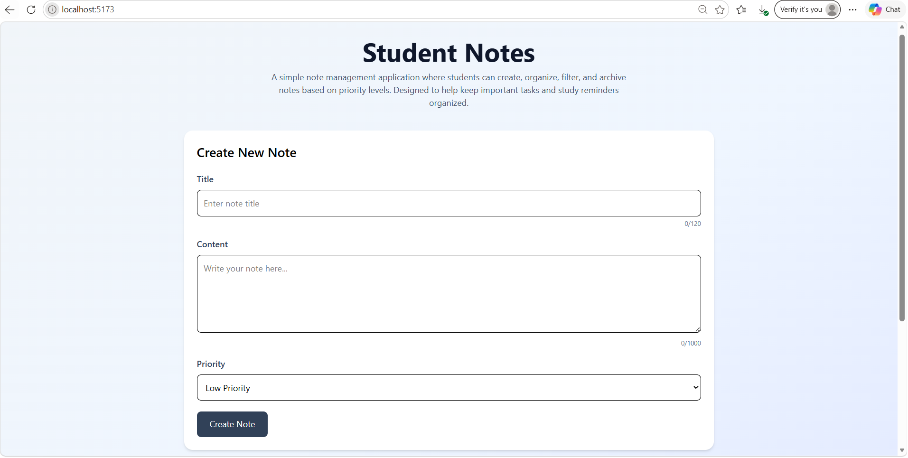
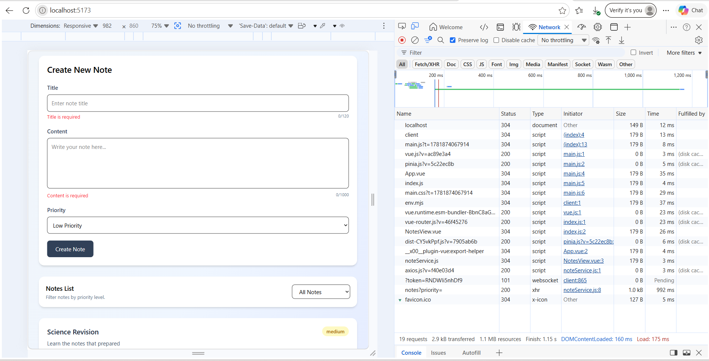
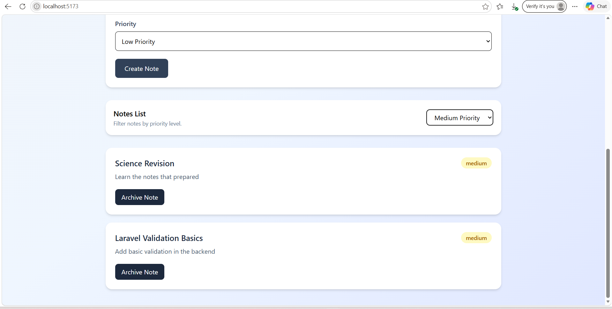
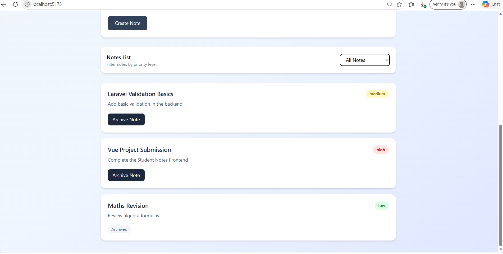
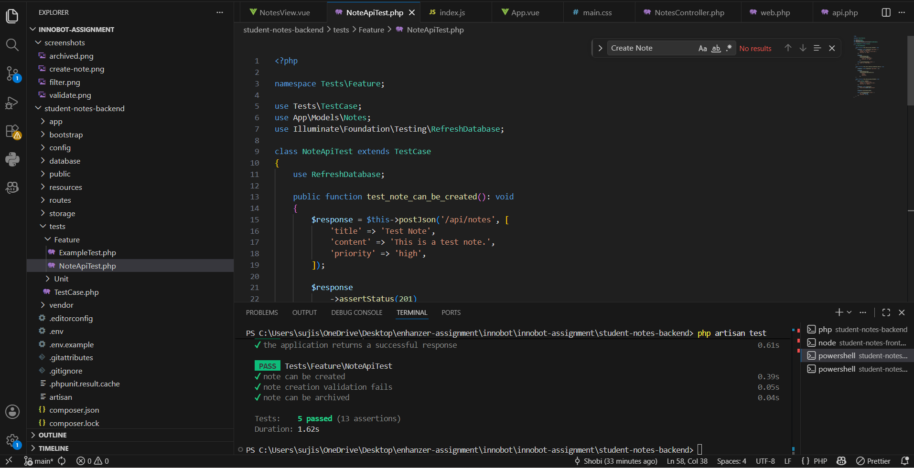
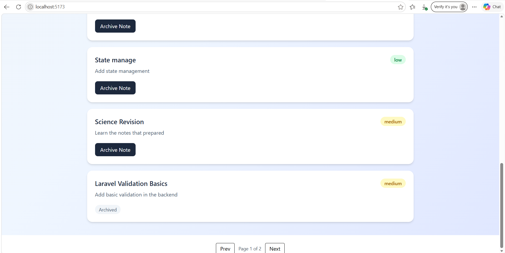

# 📝 Student Notes App (Laravel + Vue 3)

A full-stack Notes Management Application built using Laravel (REST API backend) and Vue 3 (frontend).  
The system allows users to create, view, filter, and archive notes based on priority levels.

## 🔗 Project Repository
GitHub: https://github.com/IT21821240/innobot-assignment

---

## 🧰 Tech Stack

### Backend
- Laravel 10+
- MySQL / SQLite
- PHPUnit (Feature Testing)

### Frontend
- Vue 3 (Composition API)
- Vite
- Tailwind CSS
- Vitest + Vue Test Utils

---

## 🚀 Features Implemented

### Backend
- REST API for Notes management
- Create notes with validation
- List notes with priority filtering
- Archive notes functionality
- Feature tests for API endpoints

### Frontend
- Create note form with validation
- Notes listing UI
- Filter notes by priority
- Archive notes functionality
- Success and error message handling
- Responsive UI using Tailwind CSS
- frontend unit test coverage
- Toast notification system
- Pagination added

---

## ⏳ Future Improvements

- Authentication (Laravel Sanctum / JWT)
- Role-based access control (admin/user)
- Better component structure (Vue components)
- Increased frontend unit test coverage

---

## ⚖️ Assumptions & Trade-offs

- Simple architecture used for faster development
- No authentication implemented to keep scope minimal
- Validation handled mainly in backend (Laravel validation rules)
- Frontend state managed locally instead of Pinia
- UI focused on usability over design consistency
- Application designed for single frontend consumer

---

## 📦 Setup Instructions

### Backend (Laravel)

```bash
composer install
cp .env.example .env
php artisan key:generate
php artisan migrate
php artisan serve

```

### FRONTEND (Vue)

```bash
npm install
npm run dev

```

## 📸 Sample Screenshots

### Create New Note


---

### Validate Notes


---

### Filter Notes


---

### Archived Notes


---

### Passed Test cases


---

### Pagination added


---